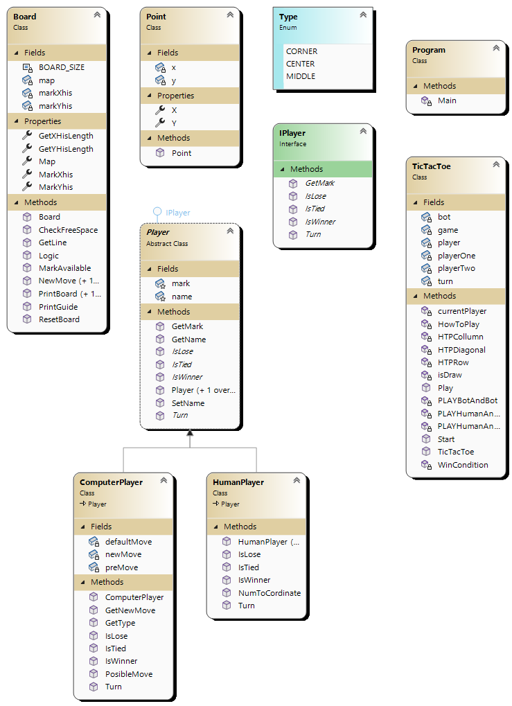
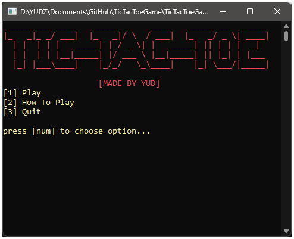
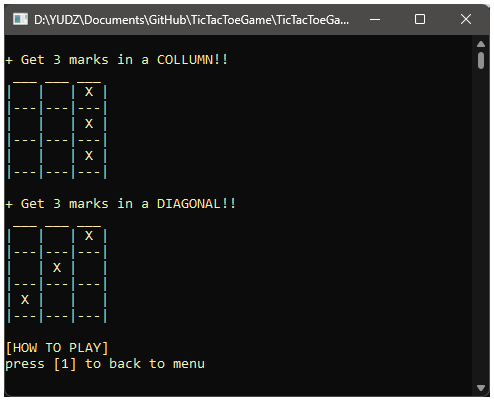
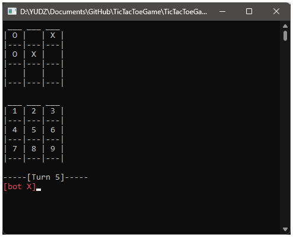

# Tic Tac Toe (CLI) ✖️⚔️⭕

This is the ending project of Basic C# first part in my CGO courses

## ✖️ UML diagram

    
  
    

## ⭕ Ingame screenshot

    
  
   
    
    

## Contributing

Pull requests are welcome. For major changes, please open an issue first
to discuss what you would like to change.

Please make sure to update tests as appropriate.

## License

[MIT](https://choosealicense.com/licenses/mit/)